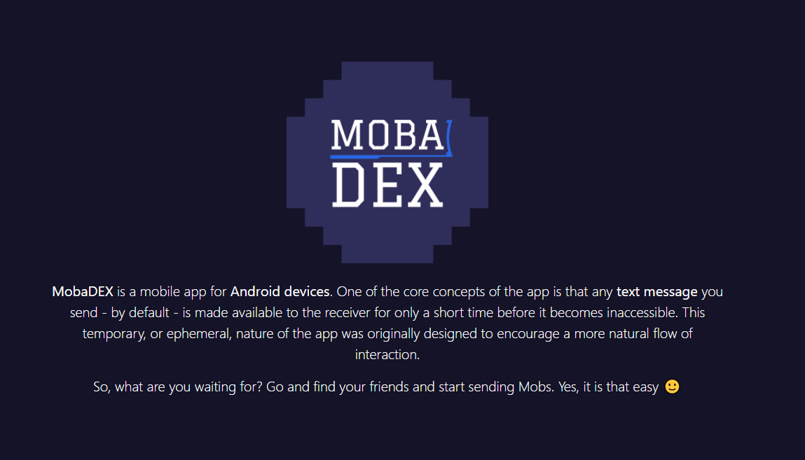
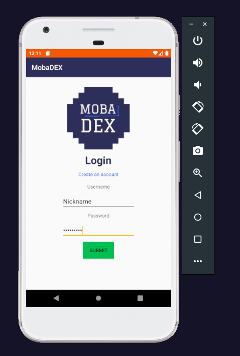
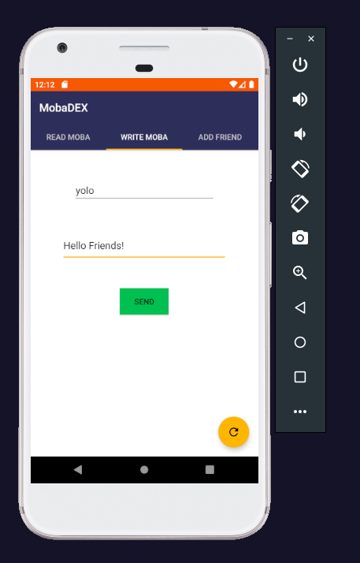
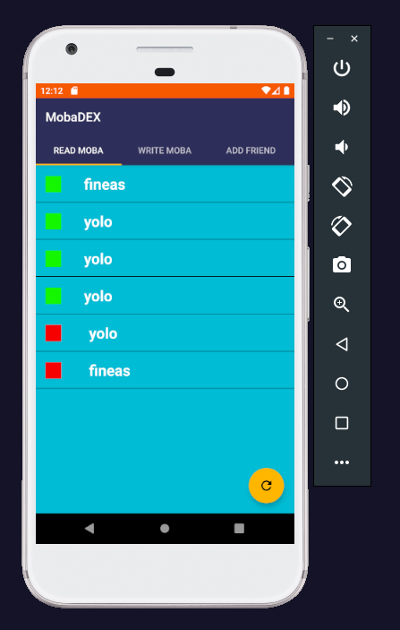
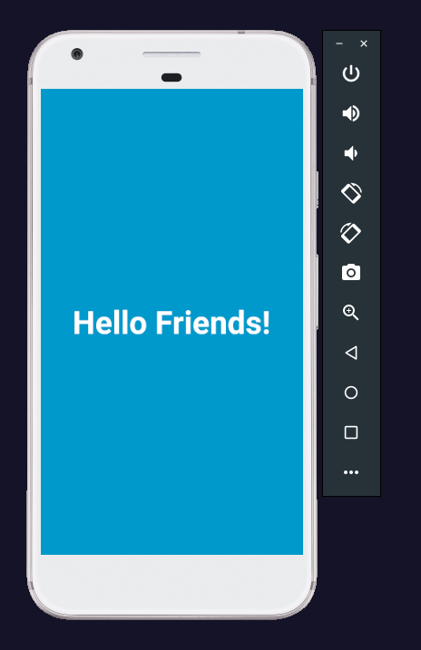

# MobaDEX

## What is MobaDEX ?
> MobaDEX is an open source messaging application for Android devices. One of the core concepts of the app is that any text message you send - by default - is made available to the receiver for only a short time before it becomes inaccessible. 

## How does it work ?
- First, `Register` an Account.
- Then, use the newly created account to `Log In`.
- `Add` new friends.
- `Send` & `Receive` Mobs.

## How to use the application?
> You can either directly download the application (`.apk`) from the [release](https://github.com/Fineas/MobaDEX/releases/tag/Beta) page __or__ [download](https://github.com/Fineas/MobaDEX.git) the source code and build the application.

## Application Preview

* Remote End: [http://35.246.216.38:8686/](http://35.246.216.38:8686/)
    

* Log In Page:
    
    

* Write Moba:
    
    

* Read Moba:
    
    

* show Moba:
    
    

## Technical Details:
> The application uses a remote API Server [http://35.246.216.38:8686/api.php](http://35.246.216.38:8686/api.php) to handle the account creation / authentication and connections between users. It is wrapped up in a docker-container which is very easy to setup and launch on any machine. The Mob term represents the message that is sent between users and it is serialized using a custom algorithm be to stored on the database which can be accessed at: [http://35.246.216.38:8664/](http://35.246.216.38:8664/). The credentials for the DB can be found inside the docker-config file.

## Other:
> The application was used in a Capture The Flag competition as an Android Exploitation Challenge. More can be read here: [https://fineas.github.io/FeDEX/post/hacktmctf.html](https://fineas.github.io/FeDEX/post/hacktmctf.html) .